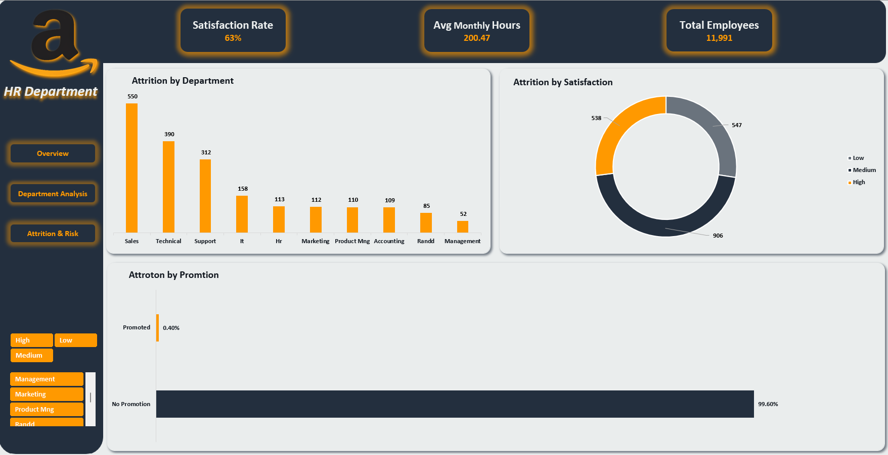

# 📊 Amazon HR Department Analytics Dashboard (Excel)

An interactive multi-tab Excel dashboard providing comprehensive insights into HR performance, employee satisfaction, department workloads, salary distribution, and attrition risk analysis using Excel, Pivot Tables, and Dynamic Slicers.

---

## 📌 Dashboard Pages

### 1. HR Overview
High-level overview analyzing overall headcount, average monthly working hours, satisfaction rate, salary distribution, and department breakdown.

### 2. Department Analysis
In-depth evaluation comparing performance ratings, working hours, project workloads, and promotion rates across departments.

### 3. Attrition & Risk Analysis
Turnover analysis identifying employee retention risks by satisfaction level, promotion history, and department.

---

## 🔑 Key Metrics & Insights
- Total Workforce: 11,991 Employees across 10 core departments.
- Overall Satisfaction Rate: 63% average satisfaction score.
- Average Working Hours: 200.47 hours/month.
- Highest Attrition Department: Sales and Technical departments experience the highest turnover.
- Key Retention Driver: Lack of promotion significantly correlates with higher employee attrition.

---

## 🛠️ Tools & Excel Techniques Used
- Data Analysis & Visualization: Microsoft Excel
- Data Transformation: Power Query
- Data Summarization: Pivot Tables & Pivot Charts
- Interactivity: Dynamic Slicers & Custom KPI Cards
